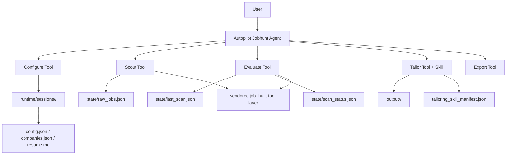
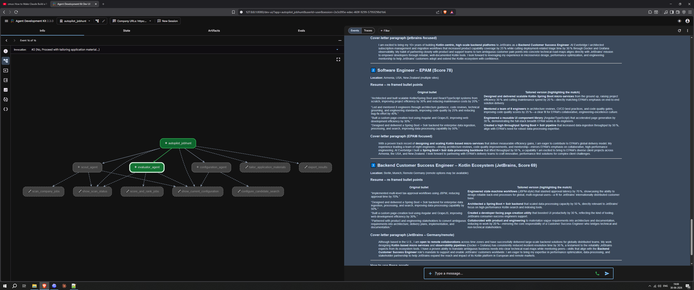

# ADK Jobhunt Pilot

`ADK Jobhunt Pilot` is a Google Agent Development Kit project for the Kaggle Google certification course. It turns a single-flow job-hunt automation into a session-aware single-agent assistant that can configure a search, scout jobs, evaluate fit, and tailor application materials with a reusable skill.

## Problem

Modern job hunting is repetitive, fragmented, and difficult to personalize well at scale:

- candidate preferences have to be restated repeatedly
- discovery, scoring, and tailoring are often blended into one opaque workflow
- resume and cover-letter customization is time-consuming and inconsistent
- deployment and secret handling are easy to get wrong in agent-based apps

## Why This Agent Design

Agents are the core of this solution, not just a wrapper around scripts.

- one `Autopilot Jobhunt Agent` owns the conversation and explicitly chooses the next workflow tool
- tool handoff keeps the workflow linear: configure, scout, evaluate, tailor, export
- session facts stay in tool outputs instead of being re-injected into the system prompt
- fewer prompt variants make cache behavior, logs, and debugging more predictable
- a repo-local `Tailoring Skill` guides truthful resume and cover-letter rewriting for a selected role

This keeps the app simpler to explain, test, and debug than a handoff-heavy agent tree.

## Solution Overview

The project runs a structured end-to-end workflow:

1. collect resume text or a resume PDF, company URLs, target roles, target locations, and thresholds
2. validate and store that configuration in a session-isolated workspace
3. scout jobs from company career pages
4. score and rank discovered jobs against the candidate profile
5. tailor a resume and cover letter for a selected job using the skill bundle
6. export scored jobs to PDF or CSV

## Architecture



## Demo Snapshot

The screenshot below shows the final ADK experience: the single master agent on the left and the tailored output view on the right.



## End-to-End Demo

One representative session looks like this:

1. The user starts a new ADK session and provides resume text or uploads a resume PDF, plus company career URLs, roles, and locations.
2. The master agent calls `configure_candidate_search(...)` to validate inputs and store them under `runtime/sessions/<session_id>/`.
3. The master agent calls `scan_company_jobs()` and writes `state/raw_jobs.json`.
4. The master agent calls `score_and_rank_jobs()` and writes `state/last_scan.json`.
5. The user selects one ranked job.
6. The tailoring flow loads the `job-application-tailor` skill and generates a tailored resume, cover letter, PDF downloads, and a trace manifest in the session output directory.
7. The user can export ranked results to PDF or CSV for later review.

## Rubric Mapping

### Code Concepts

- `Agent / tool-orchestrating system (ADK)`
  - `autopilot_jobhunt/agent.py`
  - Single root agent with stable instructions and explicit workflow tools

- `MCP Server`
  - `job_hunt/mcp_server.py`
  - preserved as the vendored MCP-compatible path for the original workflow

- `Security features`
  - `autopilot_jobhunt/services/session_files.py`
  - `autopilot_jobhunt/tools/job_tools.py`
  - secrets are injected at runtime and not written into staged session files

- `Agent skills`
  - `skills/job-application-tailor/SKILL.md`
  - `skills/job-application-tailor/references/`
  - `skills/job-application-tailor/assets/`

- `Deployability`
  - `Dockerfile`
  - `DEPLOY_CLOUD_RUN.md`

### Video-Only Concepts To Show Explicitly

- `Antigravity`
  - explain where and why it is used in the recorded demo if you are claiming it for the submission

- `Deployability`
  - show the ADK app running locally or explain the Cloud Run path and environment setup

## Tool Roles

- `configure_candidate_search(...)`
  - validates resume text or a resume PDF, URLs, roles, locations, and thresholds
  - persists session configuration and explains whether rescanning is needed

- `scan_company_jobs()`
  - discovers jobs and stages them into `state/raw_jobs.json`

- `score_and_rank_jobs()`
  - scores and ranks discovered jobs into `state/last_scan.json`

- `Tailoring Skill`
  - guides resume and cover-letter generation for one selected job
  - writes Markdown plus downloadable PDF outputs and a `tailoring_skill_manifest.json`

## Session Isolation

Each ADK session writes only inside:

```text
runtime/sessions/<session_id>/
  config.json
  companies.json
  resume.md
  manifest.json
  state/
    raw_jobs.json
    last_scan.json
    job_history.json
    scan_status.json
  output/

Uploaded resume PDFs and generated PDF deliverables are also attached to the ADK session artifact store, which makes them downloadable from the web UI in Cloud Run.
```

This design keeps session data isolated and prevents the pilot from overwriting the repo’s older root-level workflow state.

## Skill Bundle

The tailoring step uses a repo-local skill bundle:

```text
skills/job-application-tailor/
  SKILL.md
  references/
    resume-tailoring.md
    cover-letter-tailoring.md
  assets/
    application-output-checklist.md
```

The drafter loads this guidance to shape the generated resume and cover letter, then records the skill usage in a manifest for traceability.

## Local Setup

```bash
python -m venv .venv
.venv\Scripts\activate
pip install -e .[dev]
.\.venv\Scripts\python.exe -m google.adk.cli web --host 127.0.0.1 --port 8080 autopilot_jobhunt
```

Required environment variables:

- `TINYFISH_API_KEY`
- whichever LLM provider keys you plan to use, such as `GOOGLE_API_KEY` or `OPENROUTER_API_KEY`

Repo config notes:

- committed defaults live in `config.example.json`
- optional machine-specific overrides belong in a local `config.json`, which is gitignored

## Test Command

Run the tests with:

```bash
.venv\Scripts\python.exe -m pytest -q
```

Current status at the time of writing:

- `17 passed`

## Deployment Steps

This pilot is designed to run in Cloud Run with the built-in ADK web UI.

1. Build the image:

```bash
gcloud builds submit --tag gcr.io/YOUR_PROJECT_ID/adk-jobhunt-pilot
```

2. Deploy the service:

```bash
gcloud run deploy adk-jobhunt-pilot ^
  --image gcr.io/YOUR_PROJECT_ID/adk-jobhunt-pilot ^
  --platform managed ^
  --region YOUR_REGION ^
  --allow-unauthenticated ^
  --port 8080
```

3. Attach runtime secrets:

```bash
gcloud run services update adk-jobhunt-pilot ^
  --region YOUR_REGION ^
  --set-secrets TINYFISH_API_KEY=TINYFISH_API_KEY:latest,GOOGLE_API_KEY=GOOGLE_API_KEY:latest,OPENROUTER_API_KEY=OPENROUTER_API_KEY:latest
```

4. Verify the deployed app:

- the `job_hunt` package is importable in the container
- the `skills/job-application-tailor/` bundle is present
- the root agent appears in the ADK UI
- one full flow works: configure from text or PDF, scout, evaluate, tailor, export
- generated resume, cover-letter, and export PDFs are downloadable in the ADK UI

For more detail, see `DEPLOY_CLOUD_RUN.md`.

## Submission Checklist

Before submitting, make sure the repo and video clearly show:

- `ADK`: single root agent with explicit tool handoff in action
- `MCP`: the preserved MCP server path and where it fits in the architecture
- `Security`: runtime-only secret handling and session isolation
- `Agent skills`: tailoring skill folder and its use during resume/cover-letter generation
- `Deployability`: Docker + Cloud Run path
- `Antigravity`: explicitly demonstrated in the video if you plan to claim it

## Fallback Path

The original CLI and MCP entrypoints still exist for the vendored `job_hunt` package. See `FALLBACK_CLI_MCP.md`.
