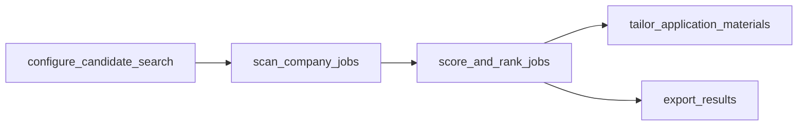
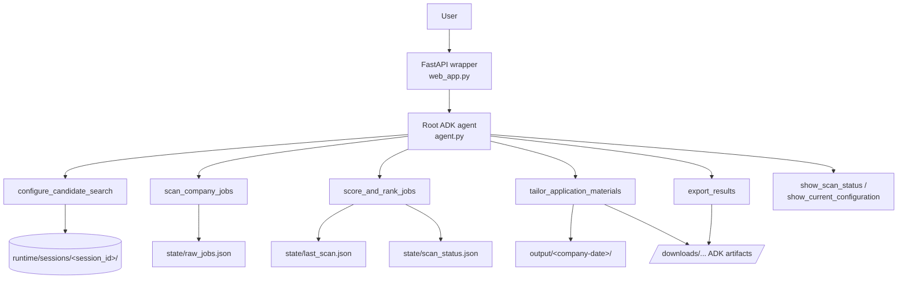

# Autopilot Jobhunt — Google ADK Agent

> A session-aware job-hunt agent built on the **Google Agent Development Kit (ADK)**. One
> conversational agent takes a candidate from *"here's my resume and the companies I care about"*
> all the way to *tailored, downloadable application materials* — configuring the search, scouting
> live company career pages, scoring each role against the resume, and rewriting the resume and
> cover letter for the one job the user picks.

<!-- 🎥 Demo video: ADD_YOUTUBE_LINK_HERE -->
<!-- 📝 Writeup: this README is the written submission; the 5-min video covers the live demo + deployment. -->

---

## Table of contents

- [Problem](#problem)
- [Why agents](#why-agents)
- [Solution overview](#solution-overview)
- [Key concepts demonstrated](#key-concepts-demonstrated-rubric-mapping)
- [Architecture](#architecture)
- [The agent and its tools](#the-agent-and-its-tools)
- [Agent skill: `job-application-tailor`](#agent-skill-job-application-tailor)
- [Security](#security)
- [Tech stack and clever tool use](#tech-stack-and-clever-tool-use)
- [Repository structure](#repository-structure)
- [Setup and local run](#setup-and-local-run)
- [Configuration and environment](#configuration-and-environment)
- [Tests and quality gates](#tests-and-quality-gates)
- [Deployment (Docker + Cloud Run)](#deployment-docker--cloud-run)
- [Project journey](#project-journey)

---

## Problem

Job hunting is repetitive, fragmented, and hard to personalize at scale:

- candidate preferences (roles, locations, thresholds) must be restated for every search;
- discovery, scoring, and tailoring are usually blurred into one opaque script;
- resume and cover-letter customization is slow, inconsistent, and often dishonestly padded;
- doing this across many companies means hours of manual browsing and copy-paste.

The interesting part is not *fetching* jobs — it is making a **truthful, ranked, tailored** pipeline
that a person can steer conversationally and trust.

## Why agents

The workflow is a sequence of *decisions*, not a fixed batch job: when to rescan vs. reuse cached
results, which discovered jobs are worth scoring, which single role to tailor for, and what to
export. A single ADK agent owns that conversation and **explicitly chooses the next tool**, so:

- the user drives the flow in natural language while the agent enforces the correct order;
- each step is an auditable tool call with structured input/output, not hidden state;
- session facts live in tool results (and on disk), not re-injected into an ever-growing prompt —
  which keeps behavior, logs, and caching predictable;
- a reusable **agent skill** governs the one genuinely subjective step (tailoring), keeping the
  rewrite grounded and truthful.

This is deliberately a **single-agent, tool-orchestrating** design rather than a handoff-heavy agent
tree — it is easier to explain, test, and demo, and every capability maps to one tool.

## Solution overview



1. **Configure** — validate and stage the resume (pasted text *or* an uploaded PDF), company career
   URLs, target roles, target locations, `min_score`, and `top_n`.
2. **Scout** — discover job postings from the configured company career pages.
3. **Score & rank** — score every discovered job against the resume with an LLM rubric and rank it.
4. **Tailor** — for the one role the user selects, generate a tailored resume + cover letter
   (Markdown **and** downloadable PDF) using the `job-application-tailor` skill.
5. **Export** — export scored results to PDF or CSV with clickable download links.

Discovered jobs and scores are **cached per session**; re-running scan/score reuses the cache unless
the configuration changed (`rescan_required`).

---

## Key concepts demonstrated (rubric mapping)

The submission demonstrates **four** of the course concepts (minimum required: three). MCP and
Antigravity are intentionally out of scope for this build.

| Key concept | Where | Evidence in this repo |
|---|---|---|
| **Agent / ADK system** | Code | `autopilot_jobhunt/agent.py` — a single ADK `root_agent` + `App` with seven workflow tools and a stable master instruction (`prompts.py`). |
| **Agent skills** | Code | `skills/job-application-tailor/` — a self-contained skill bundle (`SKILL.md` + references + checklist) loaded at tailoring time via `autopilot_jobhunt/tailoring/skill.py`. |
| **Security features** | Code | Runtime-only secret handling and per-session isolation — see [Security](#security). Secrets are never written to session files or committed to the repo. |
| **Deployability** | Code + Video | `Dockerfile` + reproducible Cloud Run steps below; the wrapped FastAPI app (`web_app.py`) serves the ADK UI and artifact download routes. |

---

## Architecture

### Runtime flow



### Layered code architecture

The codebase is organized into strict layers. The dependency direction is **enforced in CI by
import-linter** (`.importlinter`), so the agent/tool layer can never leak into low-level modules and
cycles cannot creep back in:

```text
agent / tools  ->  services  ->  { discovery, domain, export, llm, scoring, storage, tailoring }  ->  config
```

- **tools** — thin ADK entrypoints: parse `ToolContext`, call a service, format the response. No
  business logic.
- **services** — use-case orchestration (configure / scan / score / tailor / export). No ADK glue,
  no markdown.
- **discovery / scoring / tailoring / export / storage** — focused capabilities, one responsibility
  per module.
- **domain** — plain dataclasses (`JobSearchConfiguration`, `StagedSession`).
- **config** — path resolution, config loading (`config.json` + env overlay), text utilities.

## The agent and its tools

A single root agent (`autopilot_jobhunt/agent.py`) exposes seven tools:

| Tool | Purpose |
|---|---|
| `configure_candidate_search` | Validate + stage resume (text or uploaded PDF), company URLs, roles, locations, thresholds. |
| `scan_company_jobs` | Discover jobs from configured company career pages → `state/raw_jobs.json`. |
| `score_and_rank_jobs` | Score each job against the resume with an LLM rubric, rank, persist → `state/last_scan.json`. |
| `tailor_application_materials` | For one selected job, generate a tailored resume + cover letter (Markdown + PDF). |
| `export_results` | Export scored jobs to PDF or CSV with download links. |
| `show_current_configuration` | Read-only: what the session has staged. |
| `show_scan_status` | Read-only: current scout/evaluator stage and latest status. |

## Agent skill: `job-application-tailor`

Tailoring is the one subjective, high-stakes step, so it is governed by a reusable **agent skill**
rather than an ad-hoc prompt:

```text
skills/job-application-tailor/
  SKILL.md                                  # workflow + truthful-rewrite rules
  references/resume-tailoring.md            # detailed resume guidance
  references/cover-letter-tailoring.md      # detailed cover-letter guidance
  assets/application-output-checklist.md    # final-pass quality checklist
  agents/openai.yaml                         # skill agent definition
```

At tailoring time, `autopilot_jobhunt/tailoring/skill.py` loads this guidance and injects it into the
LLM prompts, and writes a `tailoring_skill_manifest.json` next to the outputs so every generated
application is **traceable** to the skill and job it came from. The skill's core rule is truthfulness:
mirror job-description language only where the candidate genuinely has the experience — never invent
credentials.

## Security

Security is enforced in code, not just described:

- **Runtime-only secrets.** `stage_session_files` writes the config for a session with
  `"tinyfish_api_key": ""` (`autopilot_jobhunt/storage/session_files.py`). The real key is injected
  only in memory at execution time via `resolve_tinyfish_api_key()` (`services/config_service.py` →
  `config/loader.py`). Secrets are **never persisted** into session files or artifacts.
- **No secrets in the repo.** `config.example.json` ships with empty key strings; `.gitignore`
  excludes `/.env`, `/config.json`, `/runtime/`, and `/output/`. There are no API keys or passwords
  anywhere in the code.
- **Placeholder guard.** The config loader ignores env values that look like placeholders
  (`YOUR_..._HERE`), so a template `.env` cannot silently clobber a real key.
- **Session isolation.** Every session reads and writes only under
  `runtime/sessions/<session_id>/` (slugified id), so concurrent sessions cannot see or overwrite
  each other's resume, config, state, or outputs.
- **No raw storage URIs leak to the user.** Generated files are served through explicit
  `/downloads/...` routes (`web_app.py`), not internal artifact URIs.

## Tech stack and clever tool use

- **Google ADK** (`google-adk`) — the agent runtime, `App`, tool calling, artifact service, and the
  built-in web UI, wrapped by a thin FastAPI app that adds download routes.
- **TinyFish** — used as an agentic web-fetch toolset for **live** job discovery and job-description
  extraction from real company career pages (not a static dataset), with rate-limit-aware batching.
- **LiteLLM + multi-provider factory** — a single provider registry powers two entrypoints: the ADK
  Agent model *and* a text-completion chat client for scoring/drafting. Providers (NVIDIA, Google,
  OpenRouter, Z.ai, OpenCode Zen, Ollama) are swappable via config/env with fallback model chains.
- **reportlab / pypdf** — render tailored resumes, cover letters, and export tables to PDF, and
  extract text from uploaded resume PDFs.

## Repository structure

```text
autopilot_jobhunt/
  agent.py            # root_agent + App (thin)
  prompts.py          # master instruction + greeting
  web_app.py          # FastAPI wrapper adding /downloads routes
  config/             # paths, config loader (config.json + env overlay), text utils
  domain/             # dataclasses (JobSearchConfiguration, StagedSession)
  llm/                # provider factory (ADK model) + chat client (scoring/drafting)
  discovery/          # TinyFish URL discovery, fetch, geoname location filter
  scoring/            # LLM job scorer
  tailoring/          # resume/cover drafter + skill loader
  export/             # PDF render, CSV, ADK artifact download links
  storage/            # session file staging, session state, scan-state JSON IO
  services/           # use-case orchestration (config/scan/score/tailor/export)
  tools/              # ADK tool entrypoints + markdown formatting
skills/job-application-tailor/   # agent skill bundle
tests/                           # pytest suite
Dockerfile                       # container entrypoint: autopilot_jobhunt.web_app:app
.importlinter                    # enforced layer boundaries
```

## Setup and local run

```powershell
python -m venv .venv
.\.venv\Scripts\Activate.ps1
pip install -e .[dev]

# Run the ADK web UI
.\.venv\Scripts\python.exe -m google.adk.cli web --host 127.0.0.1 --port 8080 autopilot_jobhunt
```

To exercise the custom clickable `/downloads/...` routes locally, run the wrapped web app instead:

```powershell
.\.venv\Scripts\python.exe -m uvicorn autopilot_jobhunt.web_app:app --host 127.0.0.1 --port 8080
```

## Configuration and environment

**Required environment variables**

- `TINYFISH_API_KEY` — job discovery / job-description fetch.
- One LLM provider key for the chosen provider: `NVIDIA_API_KEY` (default provider),
  `GOOGLE_API_KEY`, `OPENROUTER_API_KEY`, `Z_AI_API_KEY`, or `ZEN_API_KEY` for OpenCode Zen.
  Ollama runs locally and needs no key (`OLLAMA_BASE_URL` optional).

**Config notes**

- Committed defaults live in `config.example.json` (default `llm_provider` is `nvidia`). Copy it to
  a local `config.json` for machine-specific overrides — `config.json` is git-ignored.
- Environment variables override config values. `ADK_MODEL_PROVIDER` can override the provider at
  runtime.
- Supported provider values include `nvidia` (default), `google`, `openrouter`, `z_ai`, `zen` /
  `opencode_zen` for OpenCode Zen, and `ollama`.
- **Never commit real keys.** Provide them via environment variables or a local, git-ignored
  `config.json` / `.env`.

## Tests and quality gates

```powershell
.\.venv\Scripts\python.exe -m pytest -q
.\.venv\Scripts\python.exe -c "import autopilot_jobhunt.agent as a; print(a.root_agent.name)"
.\.venv\Scripts\python.exe -c "import autopilot_jobhunt.web_app as w; print(type(w.app).__name__)"
.\.venv\Scripts\lint-imports.exe --config .importlinter
```

Current baseline: **`29 passed`**, and the import-linter layer contract is **kept** (0 broken).

## Deployment (Docker + Cloud Run)

The container entrypoint is `autopilot_jobhunt.web_app:app`. Deployment is optional for judging but
fully reproducible:

Project-specific Google Cloud commands:

```powershell
# Update without build
gcloud run services update adk-jobhunt-pilot --region=asia-south1 --project=personal-projects-5aa3f --set-env-vars LOG_LEVEL=DEBUG
```

```powershell
# Build project
gcloud builds submit --tag asia-south1-docker.pkg.dev/personal-projects-5aa3f/adk-jobhunt-repo/adk-jobhunt-pilot:v1
```

```powershell
# Deploy on Google Cloud
gcloud run deploy adk-jobhunt-pilot --image asia-south1-docker.pkg.dev/personal-projects-5aa3f/adk-jobhunt-repo/adk-jobhunt-pilot:v1 --region=asia-south1 --project=personal-projects-5aa3f --platform=managed --allow-unauthenticated --port=8080 --set-env-vars LOG_LEVEL=DEBUG --set-secrets "TINYFISH_API_KEY=TINYFISH_API_KEY:latest,NVIDIA_API_KEY=NVIDIA_API_KEY:latest"
```

```powershell
# Undeploy or delete service on Google Cloud
gcloud run services delete adk-jobhunt-pilot --region=asia-south1 --project=personal-projects-5aa3f
```

Generic template:
```powershell
# 1) Build
gcloud builds submit --tag gcr.io/YOUR_PROJECT_ID/adk-jobhunt-pilot
```

```powershell
# 2) Deploy
gcloud run deploy adk-jobhunt-pilot ^
  --image gcr.io/YOUR_PROJECT_ID/adk-jobhunt-pilot ^
  --platform managed ^
  --region YOUR_REGION ^
  --allow-unauthenticated ^
  --port 8080
```

```powershell
# 3) Attach runtime secrets (never bake keys into the image)
gcloud run services update adk-jobhunt-pilot ^
  --region YOUR_REGION ^
  --set-secrets TINYFISH_API_KEY=TINYFISH_API_KEY:latest,NVIDIA_API_KEY=NVIDIA_API_KEY:latest ^
  --set-env-vars ADK_PUBLIC_BASE_URL=https://YOUR_SERVICE_URL
```

`ADK_PUBLIC_BASE_URL` should be the public HTTPS base URL of the service so returned download links
are fully qualified.

## Project journey

Most of the meaningful decisions in this project were about restraint — choosing what the agent
should *not* do — and each one is reflected directly in the code:

- **Trust company-owned pages, not a broad search.** Discovery fetches configured `careers_url`s and
  expands ATS listings instead of firing a wide search query, which keeps results precise and free of
  stale, mirrored job-board copies (`discovery/`).
- **One agent, not a swarm.** A single root agent orchestrates seven tools directly. An earlier
  handoff-heavy multi-agent design added prompt churn and ambiguous session ownership for no real
  benefit on a mostly-linear workflow.
- **One job description per LLM request, persisted immediately.** Batching many JDs into one prompt
  was slow and fragile on local models; scoring now isolates each job so a stopped run keeps its
  progress and one bad reply kills one job, not the batch (`scoring/`).
- **A versioned skill, not an ad-hoc prompt, governs tailoring.** The `job-application-tailor` skill
  enforces truthful rewriting and every generated document is traceable back to it via a manifest.
- **Enforced layering.** `agent/tools → services → capabilities → config` is kept honest by
  **import-linter** in CI, alongside pytest and an import smoke test.

The result is a small, readable codebase where each course concept maps to a specific, testable part
of the system.
